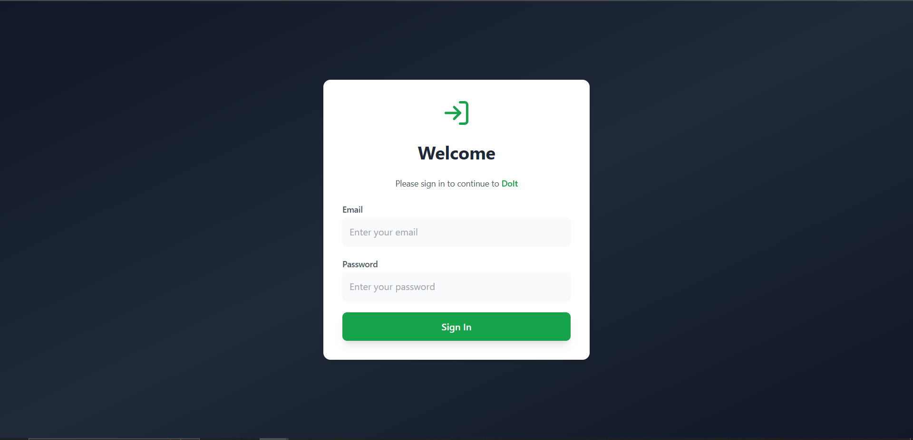
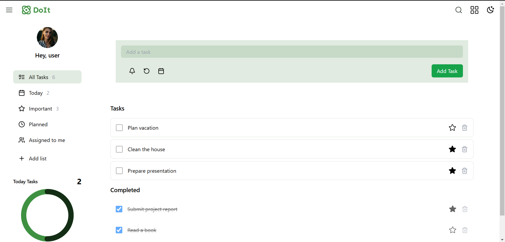
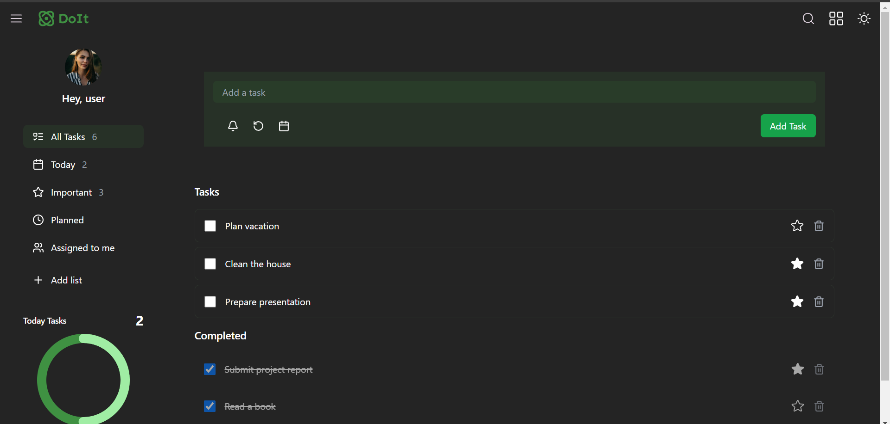

# Todo App

This is a feature-rich Todo application built using **Vite React**, **Tailwind CSS**, **Redux** and **Lucide-react icons**. The app allows users to manage their tasks efficiently and comes with multiple viewing and customization options.

## Features

1. **User Authentication**: Login functionality to personalize the experience.
2. **Task Management**:
   - Add tasks.
   - Mark tasks as completed.
   - Mark tasks as important.
   - Edit task details by clicking on the task name.
3. **Organized Views**:
   - **Today Tab**: Displays tasks added for the current day.
   - **Important Tab**: Shows tasks marked as important.
   - **Planned Tab**: Displays tasks with a due date.
4. **Analytics**:
   - A pie chart showing the ratio of pending tasks to completed tasks.
5. **Customization**:
   - Toggle between list and grid view modes.
   - Switch between dark mode and light mode.

## Deployment

This project has been deployed using **Vercel** and can be viewed at the following link:
[Todo App Live Demo](https://todo-react-swart-six.vercel.app/)

## Getting Started

Follow these steps to run the project locally:

### Prerequisites

Ensure you have **Node.js** and **npm** installed on your machine.

### Installation

1. Clone the repository:
   ```bash
   git clone https://github.com/ChirayuC01/todo-react.git
   ```
2. Navigate to the project directory:
   ```bash
   cd todo-react
   ```
3. Install dependencies:
   ```bash
   npm install
   ```
4. Start the development server:
   ```bash
   npm run dev
   ```
5. To build the project for production:
   ```bash
   npm run build
   ```

## Technologies Used

- **Vite**: Fast build tool for modern web apps.
- **React**: JavaScript library for building user interfaces.
- **Tailwind CSS**: Utility-first CSS framework for styling.
- **Redux**: State management tool.
- **Redux-persist**: Persist and rehydrate Redux store.
- **Redux-thunk**: Middleware for handling asynchronous logic in Redux.
- **Lucide-react**: Icon library for React.

## Screenshots

### Login


### Light Mode


### Light Mode Grid


### Light Mode Edit


### Dark Mode


### Dark Mode Grid


### Dark Mode Edit
